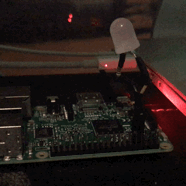

# Pi blinker

This is a script that runs on my Raspberry Pi and blinks a blue LED whenever I get a star on github

<p align="left"></p>

It's a nice little script, and I enjoy it

## Hardware

- 1 blue LED
- 1 resistor, 560 ohm
- 2 small wires
- 3 inches of electrical tape

## Schematic

<p align="left"></p>

## Installation

```bash
$ git clone https://github.com/michael-lazar/pi-blinker.git
```

Open ``pi-blinker/pi-blinker`` and add your github profile and credentials, then run

```bash
$ sudo pi-blinker/install.sh
```
